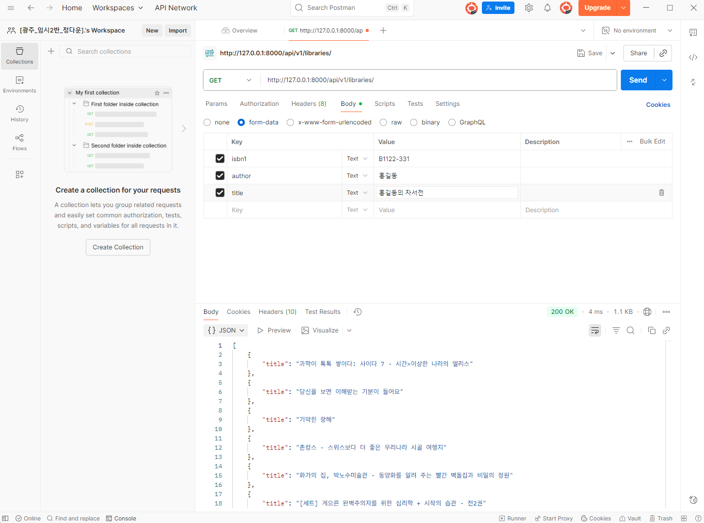

$ python -m venv venv

$ source venv/Scripts/activate

$ pip install -r requirements.txt 

$ django-admin startproject first_api_project .

$ python manage.py startapp libraries

- first_api_project/settings.py

```
INSTALLED_APPS = [
    'libraries',
    'rest_framework',
    'django.contrib.admin',
    'django.contrib.auth',
    'django.contrib.contenttypes',
    'django.contrib.sessions',
    'django.contrib.messages',
    'django.contrib.staticfiles',
]
```
    - app은 libraries만 있지만 rest_framework도 추가해줘야 됨

- libraries/models.py
```
from django.db import models

# Create your models here.
class Book(models.Model):
    isbn = models.CharField(max_length=10)
    author = models.TextField()
    title = models.TextField()
```

$ python manage.py makemigrations

$ python manage.py migrate

$ python manage.py loaddata book.json

- first_api_project/urls.py
```
from django.contrib import admin
from django.urls import path, include

urlpatterns = [
    path('admin/', admin.site.urls),
    path('api/vi/libraries/', include('libraries.urls'))
]
```

- libraries 밑에 urls.py 생성
```
from django.urls import path

from . import views
urlpatterns = [
    path('', views.index),
    path('<int:book_pk>/', views.detail)
]

# app name은 만들 필요없음 -> html을 안 만들거기 때문에 
```

- libraries 밑에 serializers.py 생성
```
from rest_framework import serializers
from .models import Book

class BookSerializer(serializers.ModelSerializer):
    class Meta:
        model = Book
        fields = '__all__'

class BookTitleSerializer(serializers.ModelSerializer):
    class Meta:
        model = Book
        fields = ('title',)
```
    - 하나는 전부 다 보내는 애, 타이틀만 보내는 애 -> 2개 만듦

- libraries/views.py
```
from rest_framework.response import Response
# data return 은 render 말고 얘한테 책임지도록 함 
from rest_framework.decorators import api_view

from .models import Book
from .serializers import BookSerializer, BookTitleSerializer

# Create your views here.
@api_view(['GET'])
# api 함수라는 의미로 데코레이터 붙임
def index(request):
    books = Book.objects.all()
    serializer = BookTitleSerializer(books, many=True)
    return Response(serializer.data)

def detail(request, book_pk):
    book = Book.objects.get(pk=book_pk)
    serializer = BookTitleSerializer(book, many=True)
    return Response(serializer.data)
```

- `libraries/`
    - GET : 전체 책의 타이틀을 return
    - POST : 신규 책 정보를 생성 
        생성된 정보를 return

- `libraries/<int:book_pk>`
    - GET : book_pk의 책의 정보를 return 
    - DELETE : book_pk의 책의 정보를 삭제하고
        {'delete': ''}, 

- libraries/view.py
```
from rest_framework.response import Response
# data return 은 render 말고 얘한테 책임지도록 함 
from rest_framework.decorators import api_view

from .models import Book
from .serializers import BookSerializer, BookTitleSerializer

# Create your views here.
@api_view(['GET'])
# api 함수라는 의미로 데코레이터 붙임
def index(request):
    if request.method == 'GET':
        books = Book.objects.all()
        serializer = BookTitleSerializer(books, many=True)
        return Response(serializer.data)
    elif request.method == 'POST':


@api_view(['GET'])
def detail(request, book_pk):
    book = Book.objects.get(pk=book_pk)
    serializer = BookTitleSerializer(book, many=True)
    return Response(serializer.data) 
```
- 여기까지 하고 post man으로 이동



- libraries/views.py

```
from rest_framework.response import Response
# data return 은 render 말고 얘한테 책임지도록 함 
from rest_framework.decorators import api_view
from rest_framework import status

from .models import Book
from .serializers import BookSerializer, BookTitleSerializer

# Create your views here.
@api_view(['GET'])
# api 함수라는 의미로 데코레이터 붙임
def index(request):
    if request.method == 'GET':
        books = Book.objects.all()
        serializer = BookTitleSerializer(books, many=True)
        return Response(serializer.data)
    elif request.method == 'POST':
        serializer = BookSerializer(data=request.data)
        if serializer.is_valid():
            serializer.save()
            return Response(serializer.data, status=status.HTTP_201_CREATED)
        else:
            return Response(serializer.data, status=status.HTTP_400_BAD_REQUEST)


@api_view(['GET'])
def detail(request, book_pk):
    book = Book.objects.get(pk=book_pk)
    serializer = BookTitleSerializer(book, many=True)
    return Response(serializer.data) 
```

- libraries/views.py

```
from rest_framework.response import Response
# data return 은 render 말고 얘한테 책임지도록 함 
from rest_framework.decorators import api_view
from rest_framework import status

from .models import Book
from .serializers import BookSerializer, BookTitleSerializer

# Create your views here.
@api_view(['GET'])
# api 함수라는 의미로 데코레이터 붙임
def index(request):
    if request.method == 'GET':
        books = Book.objects.all()
        serializer = BookTitleSerializer(books, many=True)
        return Response(serializer.data)
    elif request.method == 'POST':
        serializer = BookSerializer(data=request.data)
        if serializer.is_valid():
            serializer.save()
            return Response(serializer.data, status=status.HTTP_201_CREATED)
        else:
            return Response(serializer.data, status=status.HTTP_400_BAD_REQUEST)


@api_view(['GET', 'DELETE'])
def detail(request, book_pk):
    if request.method == 'GET':
        book = Book.objects.get(pk=book_pk)
        serializer = BookSerializer(book)
        return Response(serializer.data) 
    elif request.method == 'DELETE':
        book = Book.objects.get(pk=book_pk)
        book.delete()
        data = {'delete' : f'도서 고유번호 {book.isbn}번의 {book.title}을 삭제하였습니다.'}
        return Response(data)
```

